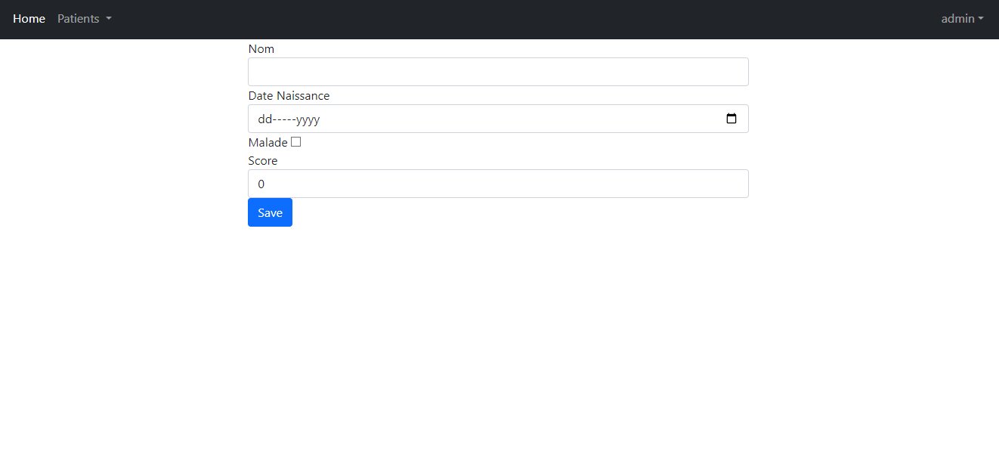
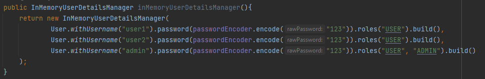
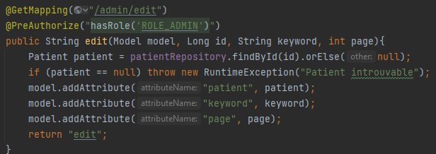
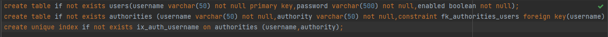
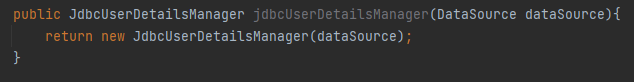
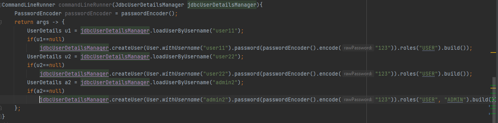
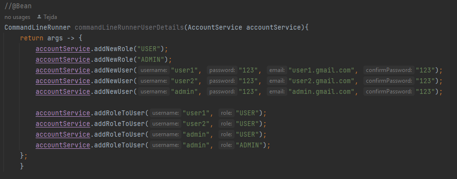
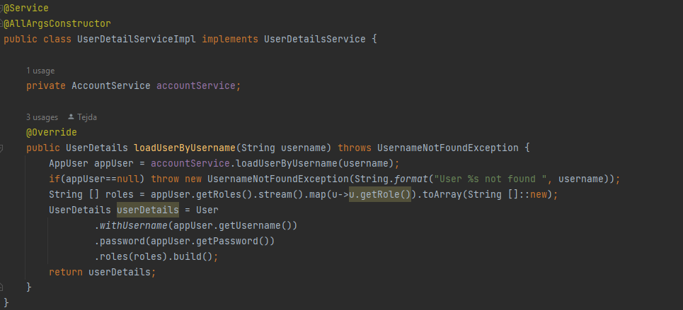

<h2>Spring Security</h2>

<h3>Interface graphique</h3>

<h4>Liste des Patients</h4>

<h4>Rechercher Patient</h4>

<h4>Ajouter Patient</h4>

<h4>Modifier Patient</h4>

<h3>Authentification</h3>

<h4>Methode InMemory</h4>

<h4>Restraindre l'accès au méthodes avec @PreAuthorize</h4>

<h4>Méthode JDBC </h4>
<h5>Script SQL pour créer les tables</h5>

<h5>Etablir la connexion avec la base de donnée</h5>

<h5>Création de Users et Role lors du démarrage</h5>

<h3>Méthode UserDetails</h3>
<h4>AppUser entity</h4>

<h4>AppRole entity</h4>

<h4>AppUser repository</h4>

<h4>RoleUser repository</h4>

<h4>Account interface</h4>

<h4>Account interface implementation</h4>

<h4>Création des Users et Roles et affectation des roles</h4>

<h4>AccountDetailService implementation</h4>

