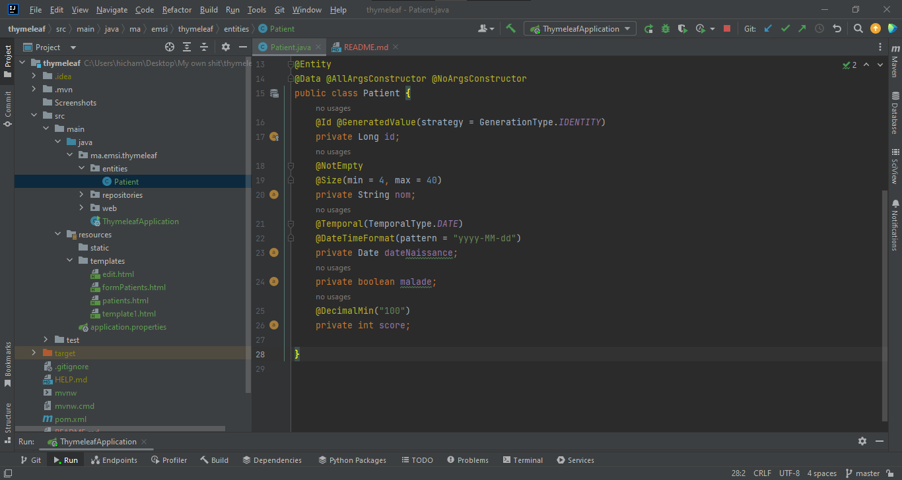
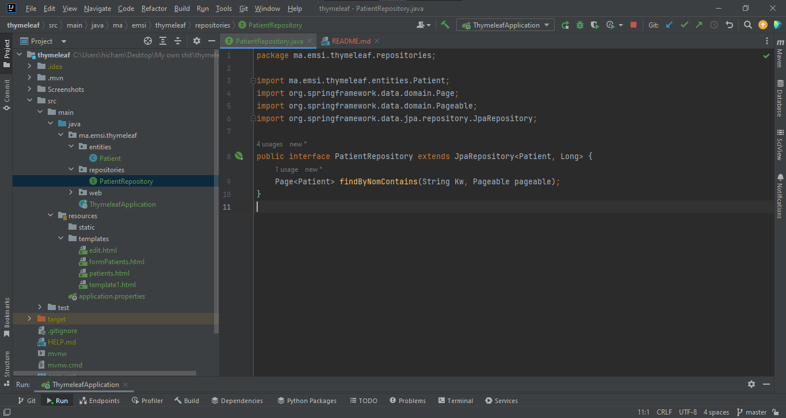
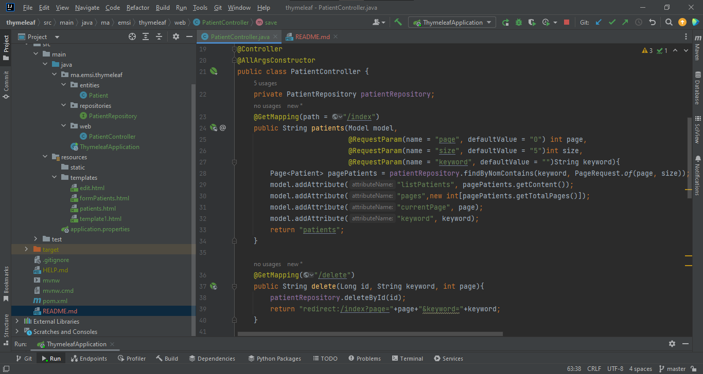
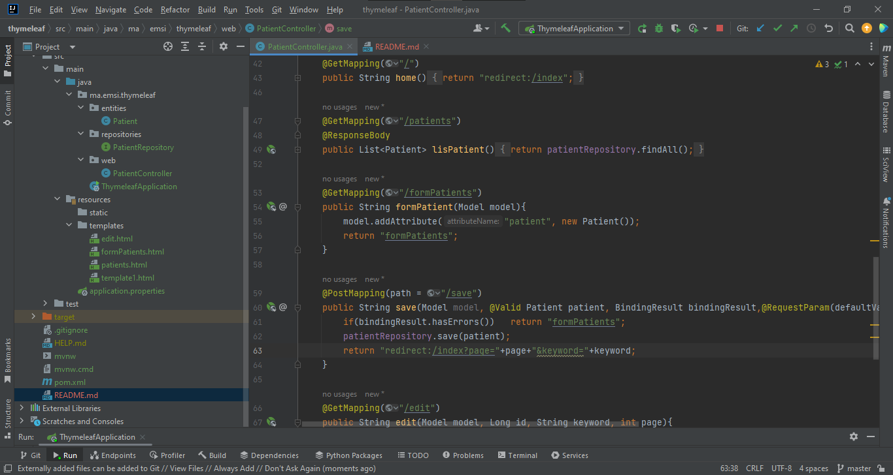
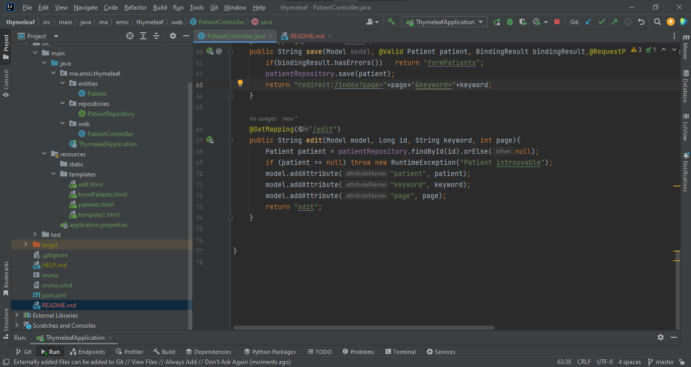
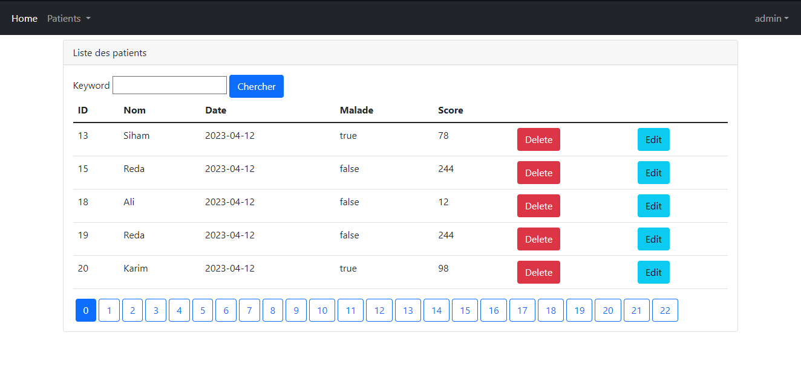
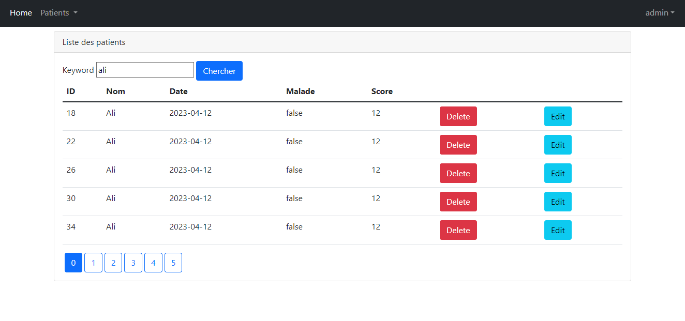
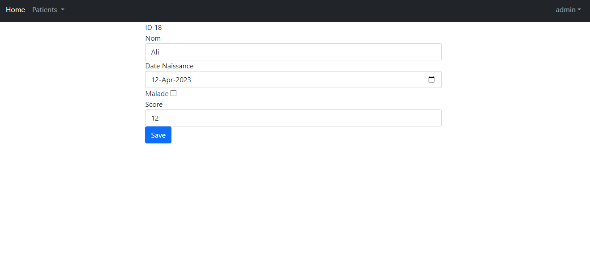

<h2>Spring MVC avec Thymeleaf</h2>

<h4>Entité JPA Patient</h4>

<h4>Interface PatientRepository</h4>

<h4>Controlleur Patient</h4>

<h3>Interface graphique</h3>

<h4>Liste des Patients</h4>

<h4>Rechercher Patient</h4>

<h4>Modifier Patient</h4>
